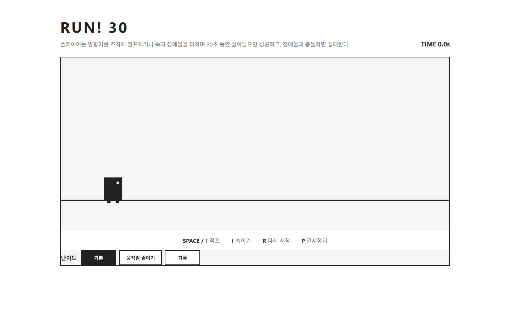
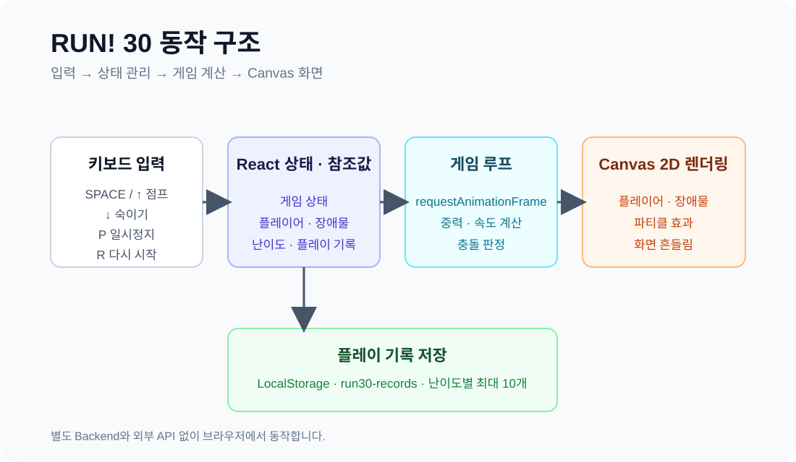
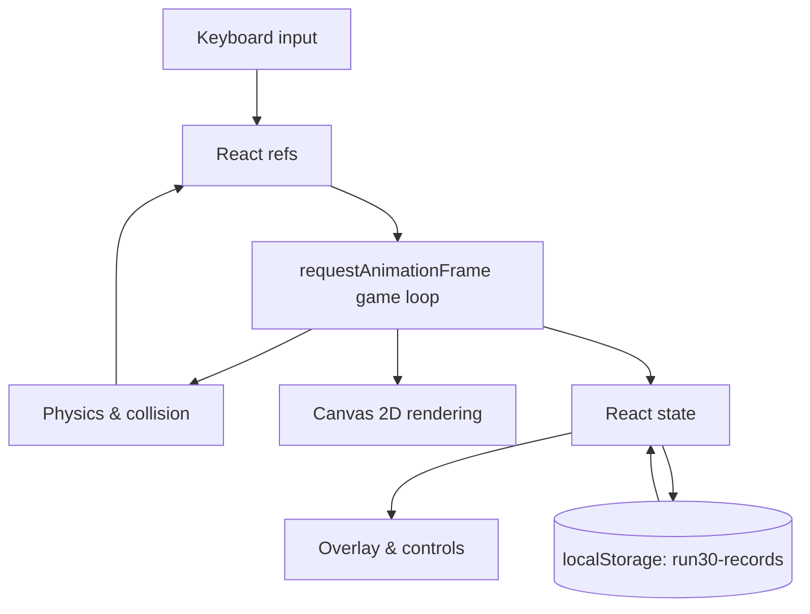

# RUN! 30

> React와 HTML Canvas 2D API로 만든 30초 생존형 러너 게임

장애물을 점프하거나 숙여 피하면서 30초 동안 살아남아 보세요. 게임 루프와 물리 계산은 Canvas에서 처리하고, 난이도·일시정지·플레이 기록 UI는 React로 구성했습니다.

<p align="center">
  
</p>

<p align="center">
  <a href="https://github.com/Gilin03/run30-canvas-runner">GitHub Repository</a>
</p>

<p align="center">
  
  
  
  
</p>

## 목차

- [프로젝트 소개](#프로젝트-소개)
- [빠른 시작](#빠른-시작)
- [플레이 방법](#플레이-방법)
- [주요 기능](#주요-기능)
- [기술 스택](#기술-스택)
- [아키텍처](#아키텍처)
- [프로젝트 구조](#프로젝트-구조)
- [검증](#검증)
- [구현 포인트](#구현-포인트)
- [향후 개선](#향후-개선)

## 프로젝트 소개

`RUN! 30`은 별도의 서버나 외부 API 없이 브라우저에서 바로 실행할 수 있는 싱글 페이지 게임입니다.

플레이어는 화면 왼쪽에서 자동으로 달리고, 오른쪽에서 다가오는 장애물을 피해야 합니다. 지상 장애물은 점프로, 공중 장애물은 숙이기로 대응할 수 있습니다. 시간이 지날수록 장애물의 이동 속도가 빨라지기 때문에 짧은 시간 안에도 반응과 타이밍을 모두 요구합니다.

### 프로젝트 목표

- React UI와 Canvas 렌더링을 하나의 화면에서 연결하기
- `requestAnimationFrame` 기반 게임 루프 구현하기
- 키보드 입력, 물리, 충돌 판정, 게임 상태를 직접 설계하기
- 서버 없이 `localStorage`로 플레이 기록 유지하기

## 빠른 시작

### 요구 사항

- Node.js `20.19+` 또는 `22.12+`
- npm

### 설치 및 실행

```bash
git clone https://github.com/Gilin03/run30-canvas-runner.git
cd run30-canvas-runner
npm install
npm run dev
```

개발 서버가 시작되면 터미널에 표시된 주소로 접속합니다. 기본 주소는 [`http://localhost:5173`](http://localhost:5173)입니다.

### Production build 확인

```bash
npm run build
npm run preview
```

이 프로젝트는 `.env` 파일, API Key, 별도 데이터베이스를 요구하지 않습니다.

## 플레이 방법

### 목표

장애물과 충돌하지 않고 **30초**를 버티면 `CLEAR`입니다. 장애물에 부딪히면 즉시 `GAME OVER`가 되고, 결과는 현재 난이도의 플레이 기록에 저장됩니다.

### 조작법

| 키 | 동작 |
| --- | --- |
| `SPACE` 또는 `↑` | 점프 |
| `↓` | 숙이기 |
| `P` | 일시정지 / 계속하기 |
| `R` | 게임 다시 시작 |

> 현재 게임은 키보드 조작을 기준으로 합니다. 모바일·터치 조작은 향후 개선 항목입니다.

### 난이도

게임이 끝난 뒤 난이도를 선택하고 다음 플레이를 시작할 수 있습니다. 플레이 중에는 난이도 버튼이 비활성화됩니다.

| 모드 | 시작 속도 | 최대 속도 | 설명 |
| --- | ---: | ---: | --- |
| `기본` | 7 | 13 | 기본 플레이 속도 |
| `움직임 줄이기` | 5 | 10 | 장애물 이동 속도를 낮춘 모드 |

두 모드 모두 플레이 시간에 따라 장애물 속도가 초당 `0.2`씩 증가하며, 각 모드의 최대 속도를 넘지 않습니다.

## 주요 기능

### 생존형 러너 플레이

- 30초 생존을 목표로 하는 타임어택 구조
- 점프와 숙이기를 활용한 두 가지 회피 방식
- 프레임 간 시간 차이를 보정하는 `requestAnimationFrame` 게임 루프
- 화면 밖으로 이동한 장애물 자동 제거

### 5종 장애물

| 장애물 | 배치 | 피하는 방법 |
| --- | --- | --- |
| 작은 바위 | 지상 | 점프 |
| 큰 바위 | 지상 | 점프 |
| 선인장 | 지상 | 점프 |
| 드론 | 공중 | 숙이기 |
| 레이저 | 공중 | 숙이기 |

공중 장애물은 같은 종류가 연속으로 등장하지 않도록 생성 로직에서 한 번 더 조정합니다.

### 게임 상태와 피드백

- `PLAYING`, `PAUSED`, `GAME OVER`, `CLEAR` 상태 관리
- `P` 입력 시 일시정지한 시간을 생존 시간에서 제외
- 충돌 시 16개의 사망 파티클 생성
- `기본` 모드에서 충돌 시 0.25초 화면 흔들림 효과
- 종료 상태에서 다시 시작 버튼과 결과 안내 표시

### 플레이 기록

- `CLEAR`와 `GAME OVER` 결과를 모두 저장
- `기본`과 `움직임 줄이기` 기록을 별도 관리
- 모드별 최대 10개 기록 표시
- 기록 모드에서 모드별 기록 삭제
- 저장 위치: 브라우저 `localStorage`
- 저장 키: `run30-records`

## 기술 스택

| 구분 | 사용 기술 |
| --- | --- |
| UI | React 19 |
| Build tool | Vite 8 |
| Language | JavaScript, ES Modules |
| Game rendering | HTML Canvas 2D API |
| Styling | CSS |
| Client persistence | Web Storage API (`localStorage`) |
| Lint | Oxlint |

## 아키텍처

게임 화면은 Canvas와 React UI를 함께 사용합니다.

- Canvas: 플레이어, 장애물, 바닥, 파티클을 매 프레임 직접 렌더링
- React state: 화면에 표시되는 시간, 게임 상태, 난이도, 기록 모달 관리
- React ref: 게임 루프에서 매 프레임 읽고 쓰는 플레이어·장애물·타이머 데이터 관리
- `localStorage`: 난이도별 플레이 기록 직렬화 및 복원





### 게임 루프 흐름

1. `requestAnimationFrame`에서 프레임 간 시간 차이를 계산합니다.
2. 플레이어의 위치와 수직 속도를 갱신해 중력·점프·착지를 처리합니다.
3. 일정 간격으로 장애물을 만들고, 경과 시간에 따라 이동 속도를 증가시킵니다.
4. 플레이어와 장애물의 충돌 영역을 검사합니다. 숙인 상태에서는 공중 장애물을 통과할 수 있습니다.
5. 충돌 또는 30초 도달 시 게임 상태를 바꾸고 결과를 저장합니다.
6. Canvas를 다시 그려 최신 게임 화면을 표시합니다.

## 프로젝트 구조

```text
run30-canvas-runner/
├── public/
│   ├── favicon.svg
│   └── icons.svg
├── docs/
│   └── images/
│       ├── architecture.svg  # 입력·게임 루프·렌더링 구조
│       └── gameplay.png      # README 실행 화면
├── src/
│   ├── assets/
│   ├── App.css               # 게임 영역·오버레이·기록 UI 스타일
│   ├── App.jsx               # 입력·게임 루프·충돌·기록 저장
│   ├── index.css             # 전역 스타일
│   └── main.jsx              # React 애플리케이션 진입점
├── index.html
├── package.json
├── package-lock.json
└── vite.config.js
```

## 검증

### 명령어 검증

```bash
npm run lint
npm run build
```

- `npm run lint`: Oxlint 정적 분석
- `npm run build`: Vite production bundle 생성

현재 `package.json`에는 별도의 자동화 테스트 스크립트가 없습니다. 주요 게임 동작은 개발 서버 실행 후 다음 시나리오로 확인할 수 있습니다.

### 수동 확인 시나리오

1. 페이지 진입 후 `SPACE` 또는 `↑`로 점프하고 `↓`로 숙이기
2. `P`로 일시정지한 뒤 시간이 멈추는지 확인하고 다시 `P`로 재개하기
3. 장애물 충돌 후 `GAME OVER`, 파티클, 화면 흔들림 확인
4. 30초 생존 후 `CLEAR`와 기록 저장 확인
5. `R` 또는 다시 시작 버튼으로 게임 상태 초기화 확인
6. 기록 모달에서 난이도별 기록 분리와 모드별 삭제 확인

## 구현 포인트

### `useState`와 `useRef`의 역할 분리

게임 루프는 컴포넌트가 처음 마운트될 때 시작되어 계속 실행되므로, 매 프레임 참조해야 하는 값은 `useRef`에 보관했습니다. 반면 시간·게임 상태·난이도·기록처럼 화면을 다시 그려야 하는 값은 `useState`로 관리했습니다.

### 일시정지 시간 보정

현재 시각과 시작 시각의 단순한 차이만 사용하면 일시정지한 시간도 생존 시간에 포함됩니다. 일시정지 시작 시점을 저장하고, 재개할 때 해당 기간만큼 시작 시각을 보정해 실제 플레이 시간만 계산하도록 했습니다.

### 종료 후 중복 기록 방지

`requestAnimationFrame`은 게임이 종료된 뒤에도 호출될 수 있습니다. `CLEAR` 처리 시 현재 상태가 `PLAYING`인지 함께 확인하고 상태를 먼저 변경해 결과가 한 번만 저장되도록 구성했습니다.

### 충돌 판정 단순화

플레이어와 장애물의 가로·세로 영역이 겹치는지 검사하는 직사각형 충돌 판정을 사용했습니다. 실제 그래픽보다 조금 좁은 충돌 영역을 적용해 조작감도 함께 고려했습니다.

## 향후 개선

- `App.jsx`에 집중된 게임 루프·충돌 판정·기록 관리 로직 분리
- 충돌 판정·난이도 속도·기록 저장에 대한 unit test 추가
- 장애물 생성 규칙과 관련 상수 정리
- 모바일·터치 조작 지원
- `prefers-reduced-motion` 및 키보드 포커스 등 접근성 개선
- GitHub Actions 기반 lint/build 자동 검증 추가
